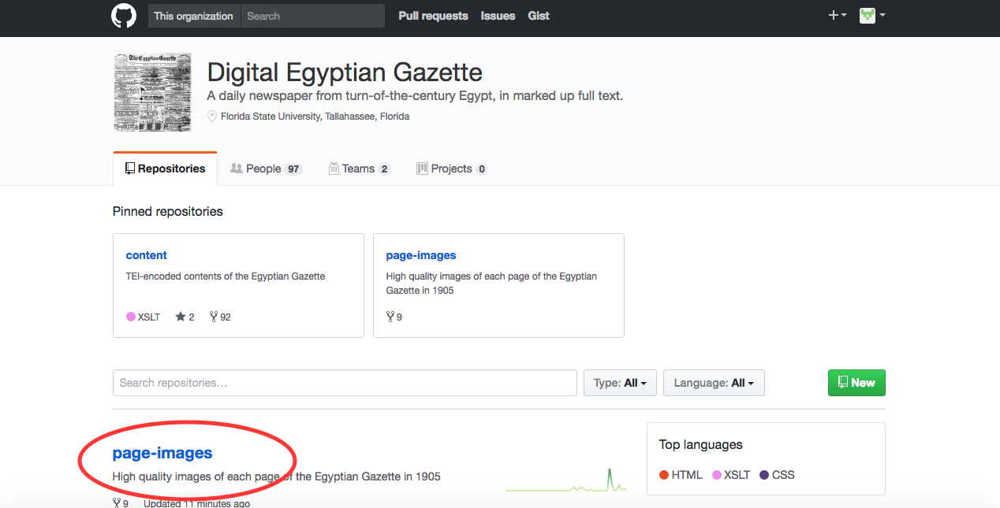
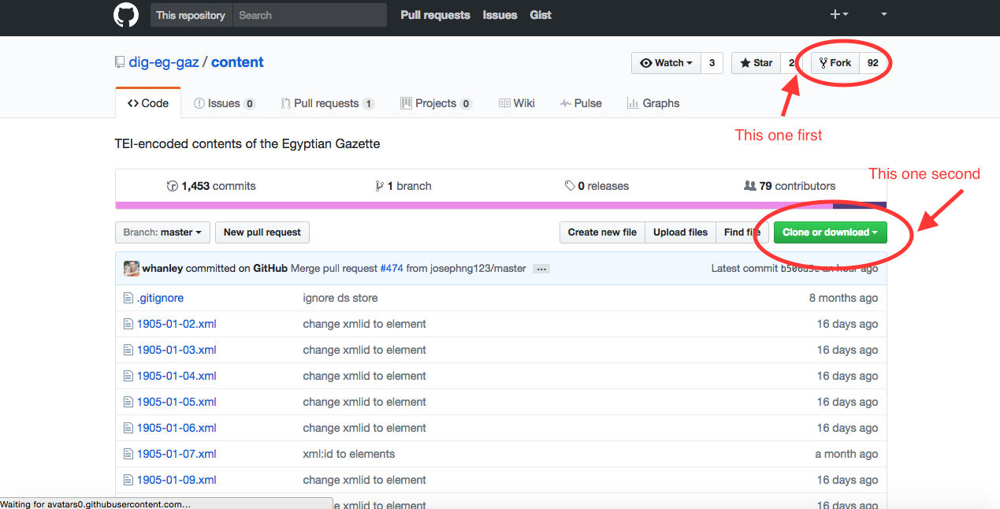

## Forking Repositories

Welcome to the wonderful world of Github. Follow these steps and you'll be well on your way to navigating this world with relative proficiency.

Step One: make a Github account. I recommend not using your FSU email because emails sent to that account not from another FSU email address are often sent to junk, but that decision is entirely up to you.

Step Two: Navigate to the dig-eg-gaz Github page. Here holds all the repositories you'll interact with during this course. You might not know what "repository" means right now, so I'll explain. The circled link in the above photo is a repository. Every student must "fork" these repositories, or create your own version that you will update and then create "pull requests" to submit your changes. At this point, you must decide whether or not to download Github desktop. Download Github Desktop. It simplifies the entire process once you get into the work and you will thank yourself halfway through the semester.

Step Three: Now you're going to fork the master repository to your own Github account. This is super easy, you just have to click about two times. Click the "Fork" button at the top right hand corner and choose your account when prompted. Done! You now have your own fork of whatever repository you're using, in this case the content repository.

Step Four: Assuming you have Desktop on your respective machine, navigate to the your fork of the content repository and click the green "Clone or Download" button encircled in the below picture. Next click the "Open in Desktop" option, or if you've opted not to use Desktop choose the "Download ZIP" option. You'll a location on your desktop that you'd like the repository folder to be stored, and then you're done. 

Congratulations! You've successfully navigated arguably the most difficult part of this class!
