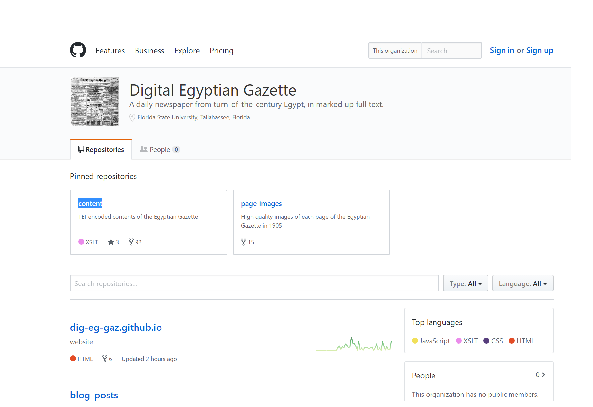
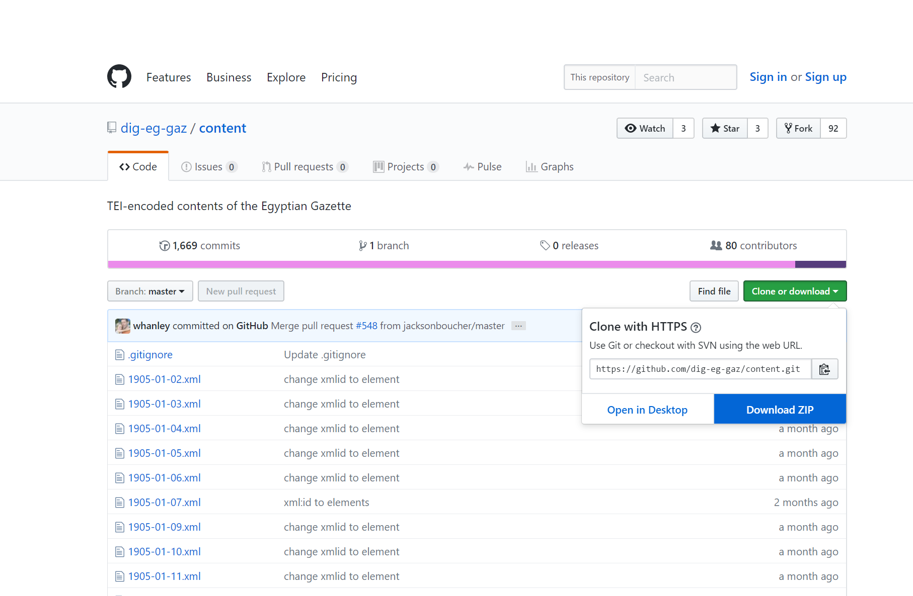
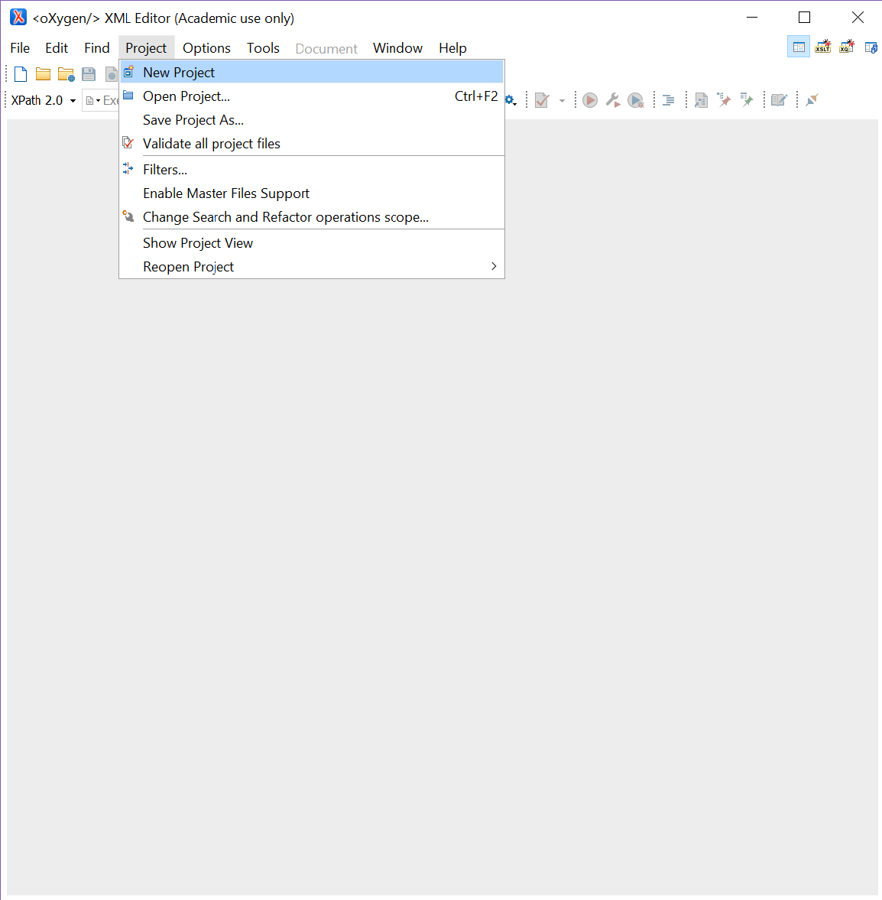
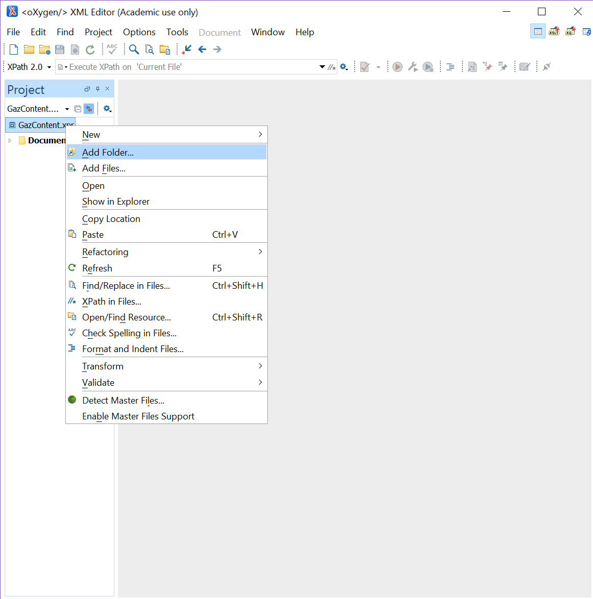
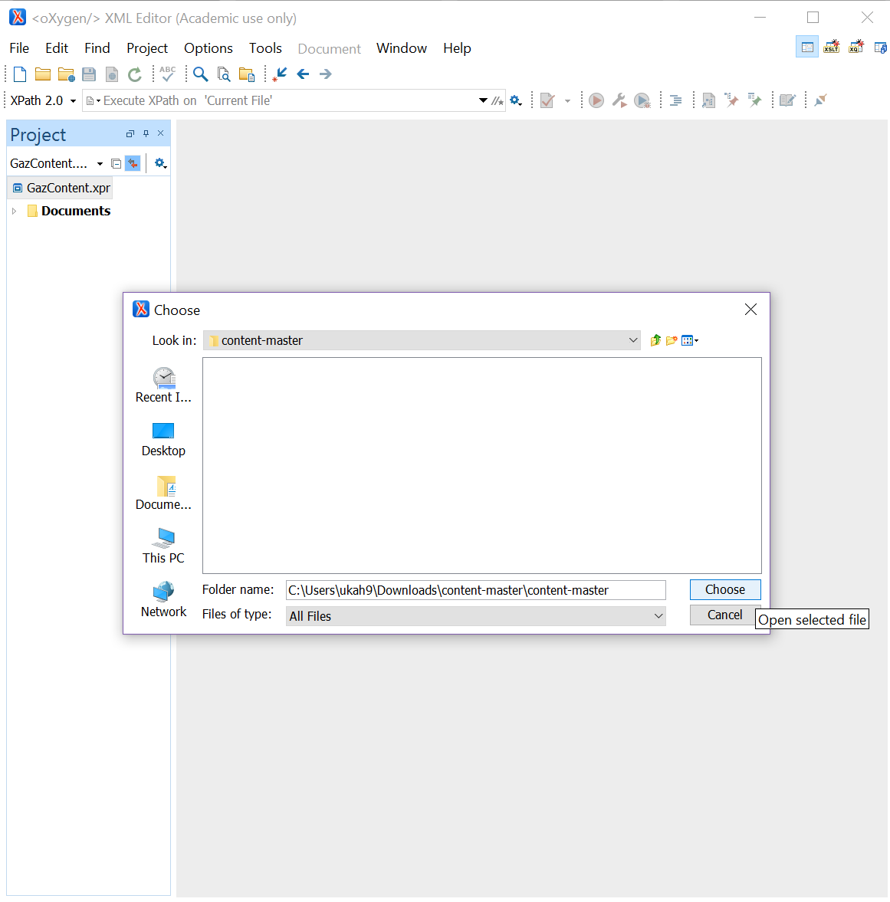
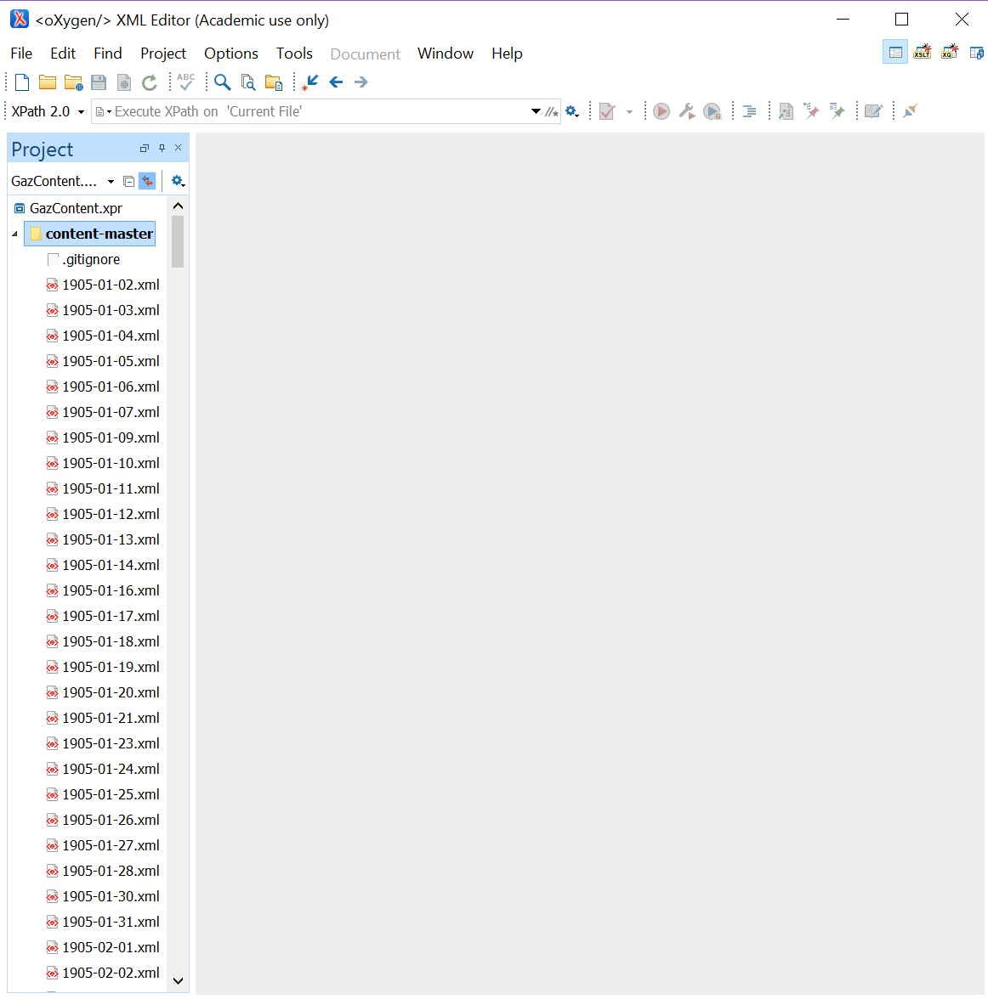

Although adding the contents of the _Egyptian Gazette_ in the form of an Oxygen project is  
not required until the analysis project, access to such information can prove very helpful  
for additional tasks such as coding issues of the _Gazette_ and finding more up to date  
boilerplate templates.

**1. Find the _Gazette_'s content repository in GitHub**

Start at the [organization home page](https://github.com/dig-eg-gaz) and click the content repository (the pinned  
and non-pinned links are identical):  

**2. Download the content ZIP file and extract it**

Click the green "Clone or download button" and download the ZIP file:  

Find that ZIP file in your computer's library, right-click it and select "Extract All".  
Wait for the process to complete.  
Another file should have been created, this new file contains the contents of the _Gazette_  
at the moment it was downloaded. Use this file to link to the Oxygen project.

**3. Create an Oxygen Project and link the extracted file**

Open Oxygen and under the Project tab, select "New Project":  

After the project is opened move over to the Project box, right-click, and select "Add  
Folder":  

Find the extracted file and select it:  

Oxygen will add the file. Access it by clicking the drop-down arrow:  

You should see the XML files corresponding to the _Gazette_ issue days.

**You're done!**

Now you can access the entire contents of the _Gazette_. 